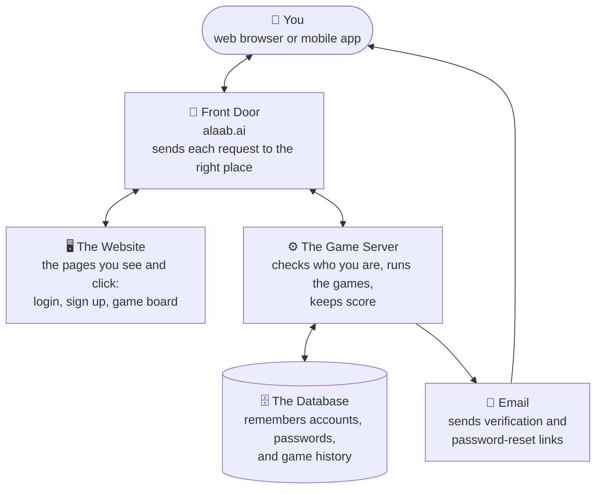

# GameHub Architecture

Two documents cover this app: this one explains *what exists and why*, in
full technical detail. `deployment guide to gcp.txt` explains *how to
operate it* (exact `gcloud` commands, secrets setup, the Cloud Run/Cloud
SQL deploy walkthrough) - the two overlap a little on purpose.

## Quick overview



In plain terms: the **Website** is passive (just pages), the **Game
Server** is the brain (checks passwords, runs the games, decides
winners), the **Database** is the filing cabinet, **Email** is used only
for signup verification and password resets, and the **Front Door**
(Caddy) makes the Website and Game Server - two genuinely separate
programs - look like one site to your browser. The **mobile app** talks
to the same Game Server over the same JSON/WebSocket API - it has no
separate backend of its own - and additionally keeps an offline queue on
the device for guest/no-connectivity play. Everything below explains
exactly how, with real file names and real commands.

---

## Where this actually runs

Backend, frontend, and Caddy are packaged into **one container image**
(see `Dockerfile`) and deployed as a single **Cloud Run** service
(`gamehub`, project `gamehub-alaab`, region `us-east1`), backed by a
**Cloud SQL** Postgres instance (`gamehub-db`, same project/region). The
mobile app is a separate, independently-built artifact (`mobile/`) that
simply talks to this same Cloud Run service over HTTPS/WSS - it doesn't
change anything about how the backend is hosted.

| Component | How many | Notes |
|---|---|---|
| Cloud Run service | **1 service, `maxScale=1`** | Game/WebSocket state (a separate `games` dict in each of `game.py`, `connect4.py`, `ludo.py`, and `court_piece.py`) lives only in one process's memory - `maxScale` is pinned to 1 *specifically* so Cloud Run never spins up a second container instance that wouldn't share in-progress games. This is the single most important constraint carried over from the app's original single-laptop design, and it still fully applies here. |
| Cloud SQL (Postgres) | **1 instance** | Managed by Google - automated backups, no self-managed cluster to babysit. Reached via a Unix socket at `/cloudsql/<connection-name>` inside the container (`run.googleapis.com/cloudsql-instances` annotation on the service), not a TCP host/port. |
| Caddy (reverse proxy) | **1 process, inside the same container** | Not a separate service - `docker-entrypoint.sh` starts both uvicorn and Caddy in the one container Cloud Run runs. |
| Frontend | **0 processes** | Static files (HTML/CSS/JS), copied into the image at build time. Caddy serves them directly from disk inside the container. |

Custom domain `alaab.ai` is mapped directly to this Cloud Run service
(a Cloud Run domain mapping, not a Cloudflare-fronted or DDNS setup) -
Google terminates TLS at its edge and forwards plain HTTP to the
container, which is why Caddy inside the container doesn't do any
certificate work itself (see below).

---

## Caddy - the traffic router (`Caddyfile`)

Caddy is the only process inside the container with its port open -
Cloud Run routes all traffic to whatever port `$PORT` is set to, and
Caddy is listening there. Its whole job is: look at the incoming
request's *path*, and either (a) hand it to the backend process, or (b)
serve a file straight off disk. It never runs any app logic itself.

```
{
    auto_https off   # Cloud Run terminates TLS at its own edge; the
                      # container only ever sees plain HTTP on $PORT
}

:{$PORT} {
    handle /api/* { reverse_proxy localhost:8000 }
    handle /ws    { reverse_proxy localhost:8000 }
    handle /ws/connect4 { reverse_proxy localhost:8000 }
    handle /ws/ludo { reverse_proxy localhost:8000 }
    handle /ws/court-piece { reverse_proxy localhost:8000 }
    handle /static/* { root * /app/frontend header Cache-Control "no-cache" file_server }
    redir / /games.html
    handle { root * /app/frontend/pages file_server }
}
```

Routing rules, in the order Caddy actually checks them:

| Request path | Goes to | Example |
|---|---|---|
| `/api/*` | **Backend**, `reverse_proxy localhost:8000` | `/api/auth/login`, `/api/stats`, `/api/connect4/stats`, `/api/ludo/stats`, `/api/court-piece/stats` |
| `/ws` | **Backend**, `reverse_proxy localhost:8000` (WebSocket upgrade) | the live Tic Tac Toe connection |
| `/ws/connect4` | **Backend**, `reverse_proxy localhost:8000` (WebSocket upgrade) | the live Connect Four connection - needs its own `handle` block since Caddy's `handle /ws` only matches that exact path, not sub-paths |
| `/ws/ludo` | **Backend**, `reverse_proxy localhost:8000` (WebSocket upgrade) | the live Ludo connection - same reason, needs its own `handle` block |
| `/ws/court-piece` | **Backend**, `reverse_proxy localhost:8000` (WebSocket upgrade) | the live Court Piece connection - same reason |
| `/static/*` | **Disk**, `frontend/` directory | `/static/css/style.css` → `frontend/static/css/style.css`. Served with `Cache-Control: no-cache` so every deploy takes effect on next page load without needing a hard refresh - the browser still caches the file, but always revalidates against the container's `ETag` first. |
| `/` (exactly) | **Redirect** to `/games.html` | `alaab.ai/` → `alaab.ai/games.html` |
| anything else | **Disk**, `frontend/pages/` directory | `/login.html` → `frontend/pages/login.html` |

Because both the "website" files and the "API" are reachable under the
*same* address (`alaab.ai`), the browser sees one origin - that's what
lets the frontend's JavaScript call the backend with a plain `fetch()`
and no special cross-site cookie configuration. The mobile app isn't a
browser, so it doesn't get this same-origin benefit automatically - it
captures the session cookie from the login response manually and resends
it on every subsequent request (see the Mobile section below).

`docker-entrypoint.sh` starts uvicorn first, waits for it to actually
answer `GET /api/auth/me` (not just "the process started" - importing
every game module and opening the DB pool takes a moment), and only then
starts Caddy. Without that wait, Cloud Run's startup probe would see
Caddy's port open and start routing real traffic before uvicorn behind
it was ready, producing 502s during every cold start.

---

## Backend - the API process (`backend/`)

A single FastAPI app (`main.py`) that returns **JSON and WebSocket
messages only - never HTML**. It has no idea the frontend or mobile app
exists; it just checks a session cookie on each request.

| File | Responsibility |
|---|---|
| `main.py` | Creates the FastAPI app, includes the routers below. |
| `config.py` | Loads env vars, defines constants: DB connection settings, session cookie settings, email regex/nickname regex/private-game-code regex, bot account emails. |
| `db.py` | A `psycopg2` connection pool (1-10 connections) and one helper function, `db_execute()`, that every query in the app goes through. |
| `security.py` | Password hashing (`bcrypt`), token generation/hashing, and the signed session cookie (`itsdangerous` - the cookie is cryptographically signed so it can't be forged, using `SESSION_SECRET`). |
| `email_utils.py` | Sends email via Gmail SMTP; builds the `https://alaab.ai/...` base URL used in verification/reset links. |
| `auth_routes.py` | Everything under `/api/auth/*` - see endpoint table below. |
| `stats_routes.py` | `/api/stats` (Tic Tac Toe) plus `/api/stats/sync-offline-results`, which the mobile app calls to upload queued offline bot-game results once it's back online. |
| `game.py` | The `/ws` WebSocket endpoint, the tic-tac-toe rules (win/draw detection), the bot AI (minimax for "hard", simple heuristics for "easy"/"medium"), and the in-memory `games` dict that holds every live match. |
| `connect4_stats_routes.py` | `/api/connect4/stats` plus `/api/connect4/stats/sync-offline-results`. |
| `connect4.py` | The `/ws/connect4` WebSocket endpoint, Connect Four's rules (7x6 gravity board, 4-in-a-row detection in all 4 directions), the bot AI (depth-limited minimax with alpha-beta pruning and a heuristic evaluation for "hard", since Connect Four's search tree is far too large to solve exhaustively like tic-tac-toe's), and its own in-memory `games` dict - a separate object from `game.py`'s, so the two games share no runtime state. |
| `ludo_stats_routes.py` | `/api/ludo/stats` plus `/api/ludo/stats/sync-offline-results`. |
| `ludo.py` | The `/ws/ludo` WebSocket endpoint, Ludo's rules (2-4 player token race, dice rolls, captures, home stretches - see "Ludo specifics" below), a greedy heuristic bot AI (dice randomness makes deep search largely pointless, unlike Connect Four), and its own in-memory `games` dict, independent of the other two. |
| `court_piece_stats_routes.py` | `/api/court-piece/stats` plus `/api/court-piece/stats/sync-offline-results`. |
| `court_piece.py` | The `/ws/court-piece` WebSocket endpoint, Court Piece's rules (trick-taking, follow-suit, trump selection, the "Double Sar" collection rule - see "Court Piece specifics" below), a single-tier rule-following bot AI, and its own in-memory `games` dict. The one thing genuinely unusual here: state broadcasts are per-connection, not one shared payload - each connection only ever receives its own seat's actual cards, everyone else's hands arrive as a bare count. |

### Every backend endpoint that exists

There is nothing else - no page routes, no admin panel, nothing. This is
the entire surface area:

| Method | Path | What it does |
|---|---|---|
| POST | `/api/auth/signup` | Create account, email a verification link |
| GET | `/api/auth/verify-email?token=` | Validates the emailed link, marks the account verified, **redirects** to `/login.html` (the one place the backend still issues a redirect, since it's answering a browser click from an email, not a `fetch()` call) |
| POST | `/api/auth/resend-verification` | Re-sends the verification email |
| POST | `/api/auth/login` | Checks credentials, sets the session cookie |
| POST | `/api/auth/logout` | Clears the session cookie |
| GET | `/api/auth/me` | Returns who's currently logged in (or `authenticated: false`) - this is what the frontend calls on page load to decide whether to redirect to the login page, and what the container's own readiness check polls on startup |
| POST | `/api/auth/forgot-password` | Emails a password reset link |
| POST | `/api/auth/reset-password` | Validates the reset token, sets a new password |
| GET | `/api/stats` | Per-player Tic Tac Toe win/loss/draw stats, broken down by opponent |
| POST | `/api/stats/sync-offline-results` | Uploads queued offline bot-game results from the mobile app |
| WS | `/ws?intent=...` | The live Tic Tac Toe connection - moves, board state, scores, bot play |
| GET | `/api/connect4/stats` | Per-player Connect Four win/loss/draw stats, broken down by opponent (same shape as `/api/stats`, separate table) |
| POST | `/api/connect4/stats/sync-offline-results` | Same as above, for Connect Four |
| WS | `/ws/connect4?intent=...` | The live Connect Four connection - column drops, board state, scores, bot play |
| GET | `/api/ludo/stats` | Per-player Ludo win/loss/draw stats, broken down by opponent(s) - a private round can have more than one opponent, so the "opponent" label is a joined list of nicknames when there's more than one |
| POST | `/api/ludo/stats/sync-offline-results` | Same as above, for Ludo |
| WS | `/ws/ludo?intent=...` | The live Ludo connection - dice rolls, token moves, board state, scores, bot play; up to 4 connections per game instead of 2 |
| GET | `/api/court-piece/stats` | Per-player Court Piece win/loss/draw stats, broken down by opponent(s), same shape as Ludo's |
| POST | `/api/court-piece/stats/sync-offline-results` | Same as above, for Court Piece |
| WS | `/ws/court-piece?intent=...` | The live Court Piece connection - trump selection, card plays, per-connection state (see "Court Piece specifics") |

### Ludo specifics

Ludo needed a genuinely different design from the other two games, since it
supports 2-4 players instead of exactly 2:

- **Seats**: 4 fixed colors, Red/Green/Yellow/Blue, assigned in that order
  as connections arrive. Turn order is always R→G→Y→B, skipping colors
  with no seat filled - so a 2-human private game just alternates between
  those two colors, no bots involved.
- **"vs Bot" mode is a separate matchmaking path**, same as the other two
  games: the human always takes Red, and Green/Yellow/Blue are immediately
  filled by bots at the chosen difficulty (one bot account can occupy
  multiple color seats in the same game - it's just a `user_id` reference
  for recording results, not a live connection).
- **Board model**: each token's position is a single integer, -1 (in the
  yard) through 56 (home/finished). Positions 0-50 map onto the shared
  52-cell path via `(color's entry offset + position) % 52`; positions
  51-56 are that color's private 6-cell home stretch, immune to capture.
  A move that would overshoot past 56 is illegal (must roll the exact
  number to finish, the standard Ludo rule).
- **Bot AI**: unlike Connect Four's minimax, Ludo's bot doesn't search
  ahead - dice randomness makes multi-ply search far less useful. Instead
  it's a greedy heuristic per difficulty (easy: random legal token;
  medium/hard: prefer capturing an opponent, then finishing a token, then
  the token making the most progress; hard additionally penalizes ending
  its turn exposed on an unsafe shared-path cell).
- **Web board rendering is schematic, not a literal cross-shaped board**:
  the 52 shared-path cells render as a wrapped 13x4 grid in plain numeric
  order, with each color's yard and home stretch as separate labeled
  strips. The mobile app's board, by contrast, *is* the traditional
  15x15 cross layout (see the Mobile section) - the two clients render
  the same server-authoritative state differently on purpose, and the
  game logic and turn order are unaffected either way.

### Request lifecycle example: logging in

1. Client (browser or mobile app): `POST https://alaab.ai/api/auth/login` with `{email, password}` as JSON.
2. Caddy sees `/api/*`, reverse-proxies it to `localhost:8000` (untouched, same request).
3. `auth_routes.login()` looks up the user via `db_execute()`, checks the
   password with `security.verify_password()` (bcrypt comparison against
   the stored hash - the real password is never stored anywhere).
4. On success, `security.create_session_cookie()` signs `{user_id, email,
   nickname}` into a cookie; the response sets it and returns
   `{"ok": true}`.
5. Every later request from that client (e.g. `GET /api/auth/me`, the
   `/ws` connection) carries that cookie, and `security.get_session()`
   verifies its signature to know who's asking - no database lookup
   needed just to check "are you logged in." The browser attaches the
   cookie automatically; the mobile app captures it from the `Set-Cookie`
   response header itself and resends it manually on every request,
   since it has no browser cookie jar to do that for it.

---

## Database (Postgres)

- **Cloud SQL** instance `gamehub-db`, project `gamehub-alaab`, region
  `us-east1` - managed by Google (automated backups, no self-managed
  cluster to operate). The container reaches it over a Unix socket at
  `/cloudsql/gamehub-alaab:us-east1:gamehub-db`, not a TCP host/port -
  Cloud Run's built-in Cloud SQL connector handles the encrypted tunnel.
- Credentials (`PGUSER`, `PGPASSWORD`, etc.) are set as Cloud Run
  environment variables, with `PGPASSWORD` specifically stored in Secret
  Manager rather than as a plain env var.
- Schema is built from seven numbered files in `backend/migrations/`,
  applied in order: `001_initial_schema.sql` (users table),
  `002_email_auth.sql` (verification/reset tokens),
  `003_nicknames_history_and_stats.sql` (nicknames, password history,
  game results), `004_bot_accounts.sql` (synthetic bot user rows so bot
  games can be recorded like any other game), `005_connect4_results.sql`
  (Connect Four's own results table, deliberately separate from
  `game_results` rather than adding a "game type" column to it),
  `006_ludo_results.sql` (Ludo's results table - one row per participant
  per finished round, grouped by an app-generated `round_id` rather than a
  DB sequence/extension, since a round can have 2-4 participants instead
  of exactly 2), `007_court_piece_results.sql` (Court Piece's results
  table, same one-row-per-participant/`round_id` pattern as Ludo's, plus
  a `team` column since a player's team - not their individual seat - is
  what actually won or lost).
- Tables: `users`, `password_history`, `email_verification_tokens`,
  `password_reset_tokens`, `game_results` (Tic Tac Toe), `connect4_results`
  (Connect Four), `ludo_results` (Ludo), `court_piece_results` (Court
  Piece). All four games' result tables are independent - same `users`
  foreign keys, no shared rows.
- The backend never opens a raw connection per-request - `db.py` keeps a
  small pool open and hands connections out as needed.
- Local development against this same instance goes through
  `cloud-sql-proxy` (`cloud-sql-proxy gamehub-alaab:us-east1:gamehub-db
  --port 5434 &`) rather than a separate local database - there is no
  local Postgres cluster in this project anymore.

---

## Frontend (`frontend/`)

Plain HTML/CSS/vanilla JS, no framework, no build step, no bundler. Caddy
serves these files exactly as they sit on disk inside the container.

| Folder | Contents |
|---|---|
| `frontend/pages/` | The full set of HTML documents: `login.html`, `signup.html`, `forgot-password.html`, `reset-password.html`, `games.html` (the post-login hub), `index.html` (the tic-tac-toe board), `connect4.html` (the Connect Four board), `ludo.html` (the Ludo board), `court-piece.html` (the Court Piece config menu + card table), `privacy.html` |
| `frontend/static/css/` | `style.css` (shared design system - colors, buttons, dark mode, matching `BRAND.md`) plus one override file per page that needs extra styling |
| `frontend/static/js/` | One script per page - each game's WebSocket client and board rendering, with no code shared between games - plus `auth-guard.js`, shared by every game page |

`auth-guard.js` is the piece that replaced server-side page protection:
on page load it calls `GET /api/auth/me`; if the answer is "not logged
in," it redirects the browser to `/login.html` with JavaScript. Because
this check happens *after* the page has already loaded (unlike a design
where the backend itself refused to send the page), there's a brief
flash of the page before the redirect fires for anyone not logged in - a
known, accepted tradeoff of making the frontend fully static.

### Court Piece specifics

Like Ludo, Court Piece needed a design different from Tic Tac Toe/
Connect Four's plain 2-connection pattern - here because of fixed
partnerships (P1+P3 vs P2+P4) and real fog-of-war requirements.

- **Seats and teams**: 4 fixed seats, `P1`/`P2`/`P3`/`P4`, always played
  in that clockwise turn order. Team A = P1+P3 (sit across from each
  other, bottom/top), Team B = P2+P4 (left/right) - standard partnership
  seating, matching Ludo's opposite-seats-are-partners layout.
- **Fog-of-war is enforced server-side, not just hidden in CSS.** This is
  the one place this game's design meaningfully differs from a typical
  "everyone sees the same broadcast" pattern: `build_state_for()` in
  court_piece.py builds a *different* JSON payload per connection - a
  seat's actual card data (`myHands`) is only ever included for the
  connection(s) that control that seat; every other seat is sent only as
  a bare card *count* (`handCounts`), never real card values.
- **Bot AI has no difficulty tiers**, unlike the other three games -
  per spec it's one "simple rule-following AI" (always follow suit,
  otherwise try to win with the lowest winning trump or discard the
  lowest card).
- **"vs Bot" mode is partnership-only**: a human always controls their
  whole partnership (P1+P3 or P2+P4) against 2 bots on the other team -
  there's no "control just one seat" option, on the web or in the mobile
  app. A `4407` WebSocket close code rejects any other combination
  requested directly.
- **Spectator promotion is FIFO** (oldest-waiting spectator gets
  promoted first when a seat opens up via `leave_table` or a disconnect)
  - this is the opposite of Ludo's "most recent spectator" rule. Each
  game picked its own semantics on purpose; Court Piece's spec explicitly
  called for "the first spectator from the queue."
- **Round results**: `court_piece_results` records one row per
  participant per finished round (same `round_id`-grouping pattern as
  `ludo_results`), storing both `seat` and `team` per row since a
  player's team, not their individual seat, is what actually won or lost.

---

## Mobile (`mobile/`)

A native Flutter app (Android), talking to the exact same Cloud Run
backend over the same JSON/WebSocket API - there is no separate mobile
backend, and no code is shared between the backend's Python game logic
and the app beyond the wire protocol matching.

| Folder | Contents |
|---|---|
| `mobile/lib/api/` | `api_client.dart` (HTTP client - login/signup/stats/sync, manually captures and resends the session cookie since there's no browser to do it) and `game_socket.dart` (a shared WebSocket client used by all four games' online modes) |
| `mobile/lib/engine/` | Pure-Dart 1:1 ports of each game's rules and bot AI from the Python backend - used *only* for offline play, never for online play (online play is always server-authoritative, same as the web) |
| `mobile/lib/screens/` | One screen per game, plus login/signup, the games hub, the guest game picker, and a generic stats screen parameterized by game |
| `mobile/lib/storage/` | `session_store.dart` (every account that's ever logged in on this device, not just the active one) and `offline_results_queue.dart` (a SQLite-backed queue of unsynced offline bot-game results, tagged by account email *and* game) |

### Why an offline mode exists at all

The app needs to work with no internet connection, syncing whatever
happened once connectivity returns. This shaped several decisions that
don't have a web equivalent:

- **Guest mode is fully offline, on purpose.** The backend's WebSocket
  endpoints all require a valid session cookie (`4401` close code
  without one) - a guest with no account literally cannot open an online
  connection. So "play offline as guest" runs a game entirely against
  the local Dart engine, never touching the network, and queues the
  result locally under a `__guest__` sentinel account.
- **Logged-in users only get online play.** Once you have an account and
  (by definition, since you logged in) had connectivity recently, offline
  bot practice is not offered - avoids maintaining two parallel "vs bot"
  experiences (local engine vs. server) for the same account.
- **The offline queue is scoped by account *and* game**, not just
  account - so switching between the four games, or between two accounts
  on the same device, never bleeds one game's or one account's pending
  results into another's stats cache.
- **Syncing never auto-picks an account.** If more than one account has
  ever logged in on the device, the Stats screen's "Sync Now" always asks
  which account queued/guest results belong to, rather than guessing -
  deliberately, since a wrong guess is worse than an extra tap.
- **Per-game sync is partial-failure-tolerant.** `syncOfflineResultsForAccount()`
  uploads each game's queue to its own endpoint independently; if one
  game's upload fails (no connectivity mid-sync), the others still
  succeed and get cleared, and only the failed game's rows stay queued
  for retry.

### Ludo and Court Piece on mobile

Both needed the same server-authoritative rules ported client-side for
offline play, which the web version never had to do:

- **Ludo's board is the literal 15x15 cross layout** (unlike the web's
  schematic wrapped-grid rendering) - cell geometry (`path`, `home`,
  `yardSlots`, `yardCells`) is ported from `frontend/static/js/ludo.js`
  into Dart records, and drawn with a `Stack` of positioned cells plus a
  `SweepGradient` center piece.
- **Court Piece offline mode seats the human at the P1+P3 partnership**
  against 2 local bots, mirroring the online "vs bot" mode's
  partnership-only design (see Court Piece specifics above) - there's no
  "control just one seat" offline option either.

### Building and releasing

`flutter build appbundle --release` produces the Play Store upload,
signed with `mobile/android/app/android.keystore` (gitignored - losing
this file means never being able to publish an update to the same Play
Store listing again, so it's backed up separately, not just relied on in
git). Package name `ai.alaab.gamehub`. There's no automated Play
Developer API publishing set up in this project - the built `.aab` is
uploaded manually through the Play Console web UI.

---

## Everything outside the app itself

- **Email**: Gmail SMTP with an App Password (`backend/email_utils.py`),
  used only for signup verification and password-reset links.
- **DNS/domain**: `alaab.ai` is mapped directly to the Cloud Run service
  via a Cloud Run domain mapping - Google manages the TLS certificate and
  terminates HTTPS at its own edge, forwarding plain HTTP to the
  container on `$PORT`. There's no DDNS, no home router port-forwarding,
  and no separate reverse-proxy layer outside of Cloud Run itself.
- **Container registry**: images are built and pushed to Artifact
  Registry (`us-east1-docker.pkg.dev/gamehub-alaab/gamehub/app`) via
  `gcloud builds submit`, then deployed with `gcloud run deploy`.

Full detail, including exact `gcloud` commands and one-time project setup,
is in `deployment guide to gcp.txt`.

---

## Complete file inventory

```
backend/
  main.py              FastAPI app + router wiring
  config.py             Env/config constants
  db.py                  Postgres connection pool + query helper
  security.py             Password hashing, session cookies
  email_utils.py            Gmail SMTP sending
  auth_routes.py              /api/auth/* (see endpoint table above)
  stats_routes.py               /api/stats + sync-offline-results (Tic Tac Toe)
  game.py                         /ws, tic-tac-toe rules, bot AI
  connect4_stats_routes.py          /api/connect4/stats + sync-offline-results
  connect4.py                         /ws/connect4, Connect Four rules, bot AI
  ludo_stats_routes.py                  /api/ludo/stats + sync-offline-results
  ludo.py                                  /ws/ludo, Ludo rules, bot AI
  court_piece_stats_routes.py                /api/court-piece/stats + sync-offline-results
  court_piece.py                                /ws/court-piece, Court Piece rules, bot AI
  requirements.txt                                Python dependencies
  migrations/                                       Numbered SQL schema files, 001-007
  .env                                                 Real secrets, local dev only (gitignored, not in repo)
  .env.example                                           Template for .env

frontend/
  pages/            HTML documents (see table above)
  static/css/        Stylesheets
  static/js/           Scripts
  static/icons/          App icons / favicons
  static/manifest.json     Web app manifest

mobile/               Native Flutter app - see Mobile section above
  lib/api/              HTTP + WebSocket clients
  lib/engine/             Pure-Dart offline rules/bot-AI ports, one per game
  lib/screens/              One screen per game, plus auth/hub/stats
  lib/storage/                SQLite offline queue + multi-account session store
  android/                      Keystore-signed release config (gitignored keystore)

Caddyfile          Routing config (see Caddy section above) - baked into the container
docker-entrypoint.sh Starts uvicorn + Caddy inside the container, with a readiness wait
Dockerfile, .dockerignore  Container image build
README.md          Project overview, setup instructions
deployment guide to gcp.txt  Full Cloud Run + Cloud SQL ops manual
BRAND.md             Design system - colors, type, spacing (web + mobile both follow this)
ARCHITECTURE.md        This file
```

---

## Commands reference

This is a condensed cheat-sheet. For the exhaustive version - one-time
project setup, secrets, custom domain mapping - see
`deployment guide to gcp.txt`.

**Deploying a backend/frontend change:**
```
gcloud builds submit --tag us-east1-docker.pkg.dev/gamehub-alaab/gamehub/app:latest --project=gamehub-alaab
gcloud run deploy gamehub --image=us-east1-docker.pkg.dev/gamehub-alaab/gamehub/app:latest --region=us-east1 --project=gamehub-alaab
```

**Verifying it's actually working:**
```
curl https://alaab.ai/api/auth/me                          # {"authenticated": false} when logged out
curl -o /dev/null -w "%{http_code}" https://alaab.ai/login.html   # 200
```

**Connecting to the production database for a one-off query:**
```
gcloud components install cloud-sql-proxy   # one-time
cloud-sql-proxy gamehub-alaab:us-east1:gamehub-db --port 5434 &
psql -h localhost -p 5434 -U tictactoe_app -d tictactoe
```

**Building the mobile app:**
```
cd mobile
flutter build apk --debug        # sideload for testing
flutter build appbundle --release   # Play Store upload
```
