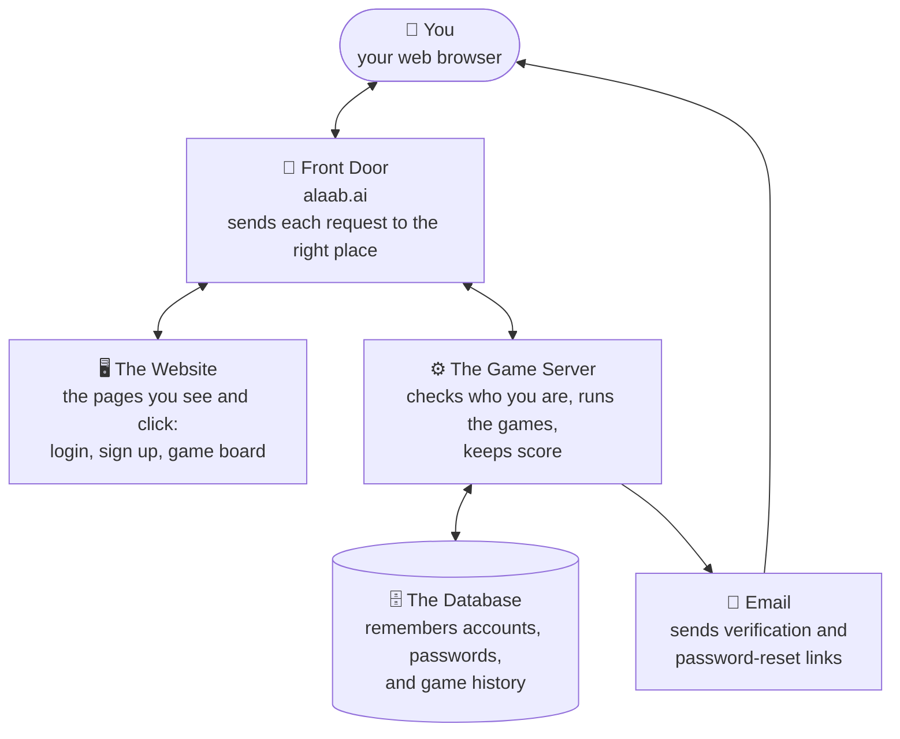

# How GameHub Works (plain-language overview)

This is a simplified picture of the app for anyone who isn't a
programmer. For the full technical breakdown, see `deployment guide.txt`.

## The big picture

Four moving parts, each with one job:

- **The Website** is just the pages themselves - what you see and click.
  It doesn't remember anything or make decisions; it just asks the Game
  Server to do things and shows you the answer.
- **The Game Server** is the brain. It checks your password, decides who
  goes first, tracks whose turn it is, and figures out who won.
- **The Database** is the filing cabinet. Every account, every password
  (safely scrambled, never stored in plain text), and every game ever
  played lives here.
- **Email** is only used twice: to send you a link when you sign up
  (to prove the email is really yours) and if you forget your password.

The **Front Door** (alaab.ai) is what makes this feel like "one website"
even though the Website and the Game Server are actually two separate
programs - it looks at each request and quietly routes it to whichever
one should handle it.

## A couple of everyday examples

**Logging in:**
1. You type your email/password into the login page (the Website) and hit
   "Log In".
2. The Website asks the Game Server "is this correct?"
3. The Game Server checks the Database, confirms it's you, and gives your
   browser a little signed note ("cookie") that says "this browser is
   logged in as you" so you don't have to log in again on every page.
4. You're dropped into the game hub.

**Playing a game:**
1. Two players' browsers both open a live connection to the Game Server
   (this is what makes moves show up instantly, with no page reloading).
2. Every move you make is sent straight to the Game Server, which checks
   it's a legal move, figures out if anyone's won, and immediately tells
   both players' browsers what the board looks like now.
3. When a game finishes, the Game Server writes the result into the
   Database so it shows up later in your stats.

**Signing up:**
1. You fill out the sign-up page (the Website).
2. The Game Server creates your account in the Database and asks Email to
   send you a "click this link to prove it's really you" message.
3. Until you click that link, you can't log in yet - this stops people
   from signing up with an email address that isn't theirs.

## Where this actually runs today

Right now, all four boxes above run on one home laptop - there's no
separate "cloud" involved yet (see `deployment guide.txt` for the exact
setup and what moving to the cloud would involve).
